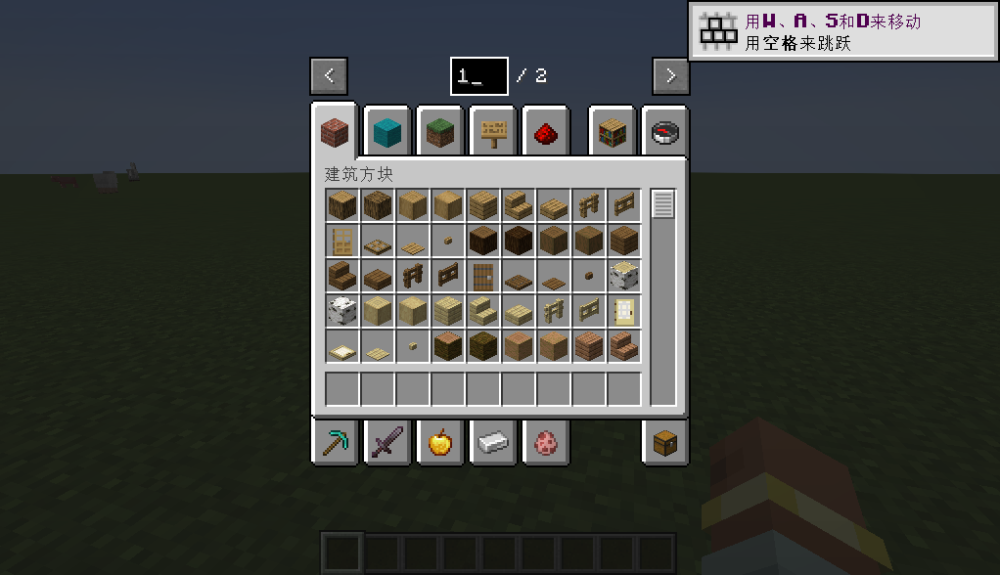

[简体中文](README-zh.md)

# 简介
该模组允许编辑创造模式物品栏上的页码以直接跳转至指定页面，无需再繁复地点击翻页按钮。 
**该模组只能在客户端上使用。** 尝试在专用服务端上加载此模组将会导致崩溃。 

# 协议
本项目使用 [GNU Lesser General Public License v3.0 only](https://spdx.org/licenses/LGPL-3.0-only.html) 授权。
